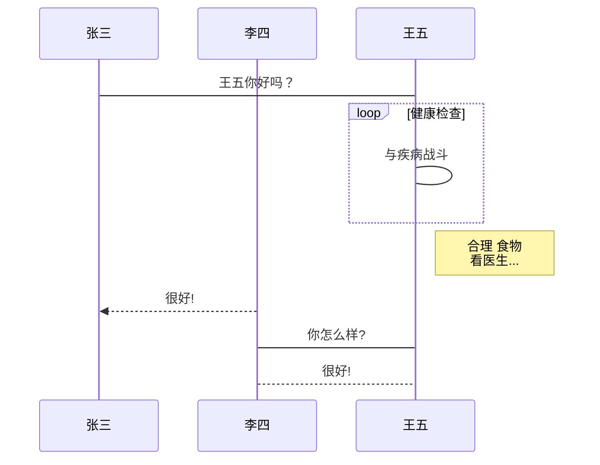

# Markdown Cheatsheet

本文档适用于检测`markdown`工具和相应`css`样式的效果, 以及速查各类写法

参考文档:

* [runoob-markdown教程](https://www.runoob.com/markdown/md-tutorial.html)

## 目录

使用`[toc]`即可将`h1`-`h6`的标题展示为目录

[toc]

## 标题

### 三级标题

#### 四级标题

##### 五级标题

###### 六级标题

`#`的个数对应`h1`-`h6`的标题, 非常好记

```markdown
# 一级标题
## 二级标题
### 三级标题
#### 四级标题
##### 五级标题
###### 六级标题
```

标题可以被链接到

[目录](#目录)

```markdown
[目录](#目录)
```

**tips**: 如果标题中包含一些特殊的内容(例如: 空格, 大写字母), 则按照以下方式修改链接内容既可实现链接。


* 大写字母改成小写
* 特殊字符全删除
* 空格改成横线（-）

[Markdown Cheatsheet](#markdown-cheatsheet)

```markdown
[Markdown Cheatsheet](#markdown-cheatsheet)
```

## 文本

### 醒目字体

可以使用一对`**`或者`__`来包裹文字对其加粗, 使用一对`*`或`_`来包裹文字对其改变为斜体, 同样两者同时使用就是粗斜体

| 标记           | 效果         |
| -------------- | ------------ |
| `**粗体**`     | **粗体**     |
| `*斜体*`       | *斜体*       |
| `__粗体__`     | __粗体__     |
| `_斜体_`       | _斜体_       |
| `***粗斜体***` | ***粗斜体*** |
| `___粗斜体___` | ___粗斜体___ |

### 分割线

三个以上的`*`或者`_`, 都可以建立分隔符, 以下的写法都是正确的

* `***`
* `* * *`
* `*****`
* `- - -`
* `----------`

### 删除线

使用一对`~~`来包裹文字对其显示删除线, 改方法可以和粗体斜体粗斜体同时使用, 甚至也能和`代码`同时使用

例如: ~~普通文字~~, ~~**粗体**~~, ~~*斜体*~~, ~~__粗体__~~, ~~_斜体_~~, ~~***粗斜体***~~, ~~___粗斜体___~~, ~~`code`~~

## 列表

### 有序列表

1. 第一项
2. 第二项
3. 第三项

```markdown
1. 第一项
2. 第二项
3. 第三项
```

### 无序列表

无序列表可以使用 `*`, `-`, `+` 来进行构建

* 第一项
* 第二项
* 第三项

```markdown
* 第一项
* 第二项
* 第三项
```

### 列表嵌套

有序列表, 无序列表, 互相之间都可以进行嵌套

例如:

1. 第一项
    * 第一项嵌套的第一个元素
    * 第一项嵌套的第二个元素
2. 第二项：
    * 第二项嵌套的第一个元素
    * 第二项嵌套的第二个元素

```markdown
1. 第一项
    * 第一项嵌套的第一个元素
    * 第一项嵌套的第二个元素
2. 第二项：
    * 第二项嵌套的第一个元素
    * 第二项嵌套的第二个元素
```

### check框

在列表中使用 `[ ]` 或者 `[X]` 即可为列表展示check框

1. [X] 第一项
    * [X] 第一项嵌套的第一个元素
    * [X] 第一项嵌套的第二个元素
2. [ ] 第二项：
    * [ ] 第二项嵌套的第一个元素
    * [ ] 第二项嵌套的第二个元素

```markdown
1. [X] 第一项
    * [X] 第一项嵌套的第一个元素
    * [X] 第一项嵌套的第二个元素
2. [ ] 第二项：
    * [ ] 第二项嵌套的第一个元素
    * [ ] 第二项嵌套的第二个元素
```

## 引用块

> 这是一个引用块

### 自身嵌套

> 最外层
> > 第一层嵌套
> > > 第二层嵌套

```markdown
> 最外层
> > 第一层嵌套
> > > 第二层嵌套
```

### 嵌套列表

> 区块中使用列表
>
> 1. 第一项
> 2. 第二项
>
> * 第一项
> * 第二项
> * 第三项

```markdwon
> 区块中使用列表
>
> 1. 第一项
> 2. 第二项
>
> * 第一项
> * 第二项
> * 第三项
```

### 嵌套在列表中

* 某件事情
    > 这件事情很微妙

1. 第一件事
    > 这件事情很微妙

```markdown
* 某件事情
    > 这件事情很微妙

1. 第一件事
    > 这件事情很微妙
```

## 代码

### 片段

使用一对 `` ` `` 包裹`文本`使其变为代码片段

```markdown
`文本`
```

### 代码块

使用一对 ` ``` ` 包裹代码可以使其成为代码块, 在第一个 ` ``` ` 其后直接添加某种语言的名称还可以对代码进行高亮处理,  ``例如:```javascript``

> 以上这段在`markdown lint`检查中疯狂报错, 只能这样把一小段文本写在里面帮助区分`` ` ``

```javascript
function jsfunc (data, callback) {
    console.log(data);
    callback();
}
```

```markdown
    ```javascript
    function jsfunc (data, callback) {
        console.log(data);
        callback();
    }
    ```
```

在引用中使用代码块

> ```js
> console.log("hello");
> ```

## 链接及图片

### 链接

[baidu链接](http://baidu.com)
[变量链接][自己起名]

[自己起名]: http://baidu.com

```markdown
[baidu链接](http://baidu.com)
[变量链接][自己起名]

[自己起名]: http://baidu.com
```

### 图片


```markdown

```

同样也可以使用变量地址

![一张图片][img]

[img]: https://i0.hdslb.com/bfs/archive/4de86ebf90b044bf9ba2becf042a8977062b3f99.png

```markdown
![一张图片][img]

[img]: https://i0.hdslb.com/bfs/archive/4de86ebf90b044bf9ba2becf042a8977062b3f99.png
```

## 表格

| 左对齐 | 右对齐 | 居中对齐 |
| :----- | -----: | :------: |
| 单元格 | 单元格 |  单元格  |
| 单元格 | 单元格 |  单元格  |

```markdown
| 左对齐 | 右对齐 | 居中对齐 |
| :----- | -----: | :------: |
| 单元格 | 单元格 |  单元格  |
| 单元格 | 单元格 |  单元格  |
```

## 公式

$$
E=mc^2
$$

```markdown
$$
E=mc^2
$$
```

## 图表

```flow
st=>start: 开始框
op=>operation: 处理框
cond=>condition: 判断框(是或否?)
sub1=>subroutine: 子流程
io=>inputoutput: 输入输出框
e=>end: 结束框
st->op->cond
cond(yes)->io->e
cond(no)->sub1(right)->op
```

```markdown
    ```flow
    st=>start: 开始框
    op=>operation: 处理框
    cond=>condition: 判断框(是或否?)
    sub1=>subroutine: 子流程
    io=>inputoutput: 输入输出框
    e=>end: 结束框
    st->op->cond
    cond(yes)->io->e
    cond(no)->sub1(right)->op
    ```
```

```sequence
对象A->对象B: 对象B你好吗?（请求）
Note right of 对象B: 对象B的描述
Note left of 对象A: 对象A的描述(提示)
对象B-->对象A: 我很好(响应)
对象A->对象B: 你真的好吗？
```

```markdown
    ```sequence
    对象A->对象B: 对象B你好吗?（请求）
    Note right of 对象B: 对象B的描述
    Note left of 对象A: 对象A的描述(提示)
    对象B-->对象A: 我很好(响应)
    对象A->对象B: 你真的好吗？
    ```
```

```sequence
Title: 标题：复杂使用
对象A->对象B: 对象B你好吗?（请求）
Note right of 对象B: 对象B的描述
Note left of 对象A: 对象A的描述(提示)
对象B-->对象A: 我很好(响应)
对象B->小三: 你好吗
小三-->>对象A: 对象B找我了
对象A->对象B: 你真的好吗？
Note over 小三,对象B: 我们是朋友
participant C
Note right of C: 没人陪我玩
```

```markdown
    ```sequence
    Title: 标题：复杂使用
    对象A->对象B: 对象B你好吗?（请求）
    Note right of 对象B: 对象B的描述
    Note left of 对象A: 对象A的描述(提示)
    对象B-->对象A: 我很好(响应)
    对象B->小三: 你好吗
    小三-->>对象A: 对象B找我了
    对象A->对象B: 你真的好吗？
    Note over 小三,对象B: 我们是朋友
    participant C
    Note right of C: 没人陪我玩
    ```
```



```markdown
    ```mermaid
    %% 时序图例子,-> 直线，-->虚线，->>实线箭头
    sequenceDiagram
        participant 张三
        participant 李四
        张三->王五: 王五你好吗？
        loop 健康检查
            王五->王五: 与疾病战斗
        end
        Note right of 王五: 合理 食物 <br/>看医生...
        李四-->>张三: 很好!
        王五->李四: 你怎么样?
        李四-->王五: 很好!
    ```
```

## latex

$\Gamma$、$\iota$、$\sigma$、$\phi$、$\upsilon$、$\Pi$、$\Bbbk$、$\heartsuit$、$\int$、$\oint$

$\tan$、$\sin$、$\cos$、$\lg$、$\arcsin$、$\arctan$、$\min$、$\max$、$\exp$、$\log$

$+$、$-$、$=$、$>$、$<$、$\times$、$\div$、$\equiv$、$\leq$、$\geq$、$\neq$

$\cup$、$\cap$、$\in$、$\notin$、$\ni$、$\subset$、$\subseteq$、$\supset$、$\supseteq$、$\N$、$\Z$、$\R$、$\R$、$\infty$

$f(x)=\frac{P(x)}{Q(x)}$

$2x - 5y =  8$  
$3x + 9y =  -12$
$7x \times 2y \neq 3z$

$x^3+x^9+x^y$

$\sqrt{3x-1}+\sqrt[5]{2y^5-4}$

$$\cos (2\theta) = \cos^2 \theta - \sin^2 \theta$$

$$\frac{x}{2y} +\frac{x-y}{x+y} $$

$$\sum_{n=1}^\infty k$$

$$\lim\limits_{x \to \infty} \exp(-x) = 0$$

$$\frac{n!}{k!(n-k)!} = \binom{n}{k}$$

$$
  \begin{matrix}
   1 & 2 & 3 \\
   4 & 5 & 6 \\
   7 & 8 & 9
  \end{matrix} 
$$

$$
X(m,n)=
\begin{cases}
x(n),\\
x(n-1),\\
x(n+1)
\end{cases}
$$